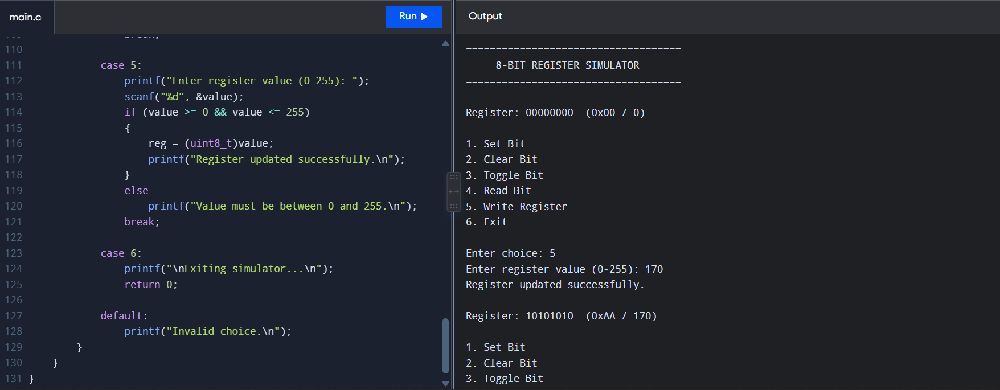

# 8-bit Register Manipulation Simulator

A C-based simulator that demonstrates basic manipulation of an 8-bit hardware-style register using bitwise operations.

## Project Objective

The purpose of this project is to connect C programming concepts with low-level digital and VLSI concepts such as registers, bits, masking and bit manipulation.

## Features

- Set an individual bit
- Clear an individual bit
- Toggle an individual bit
- Read an individual bit
- Write an 8-bit register value
- Display register value in binary
- Display register value in hexadecimal
- Display register value in decimal

## C Concepts Used

- Functions
- Pointers
- `uint8_t`
- Bitwise AND `&`
- Bitwise OR `|`
- Bitwise XOR `^`
- Bitwise NOT `~`
- Bit shifting `<<` and `>>`
- Bit masking
- `switch` statements
- Loops

## VLSI Relevance

Digital systems use registers to store and manipulate binary data.

This project provides a simple software model of common register operations used in low-level programming and digital hardware concepts.

## Register Representation

The simulator uses an 8-bit register:

```text
Bit:       7 6 5 4 3 2 1 0
Register:  0 0 0 0 0 0 0 0
```

## Example

Starting value:

```text
10101010
0xAA
170
```

After setting Bit 0:

```text
10101011
0xAB
171
```

After clearing Bit 3:

```text
10100011
0xA3
163
```

## Testing

The simulator was tested using a C compiler and successfully performed register write, bit set and bit clear operations.

## Output

The program produces an interactive terminal-based output showing the current register value and available bit manipulation operations.



## Future Improvements

- Add register rotation operations
- Add multiple registers
- Add status flags
- Add simulated memory-mapped registers
- Add a graphical interface.

## Author

Kalyan
